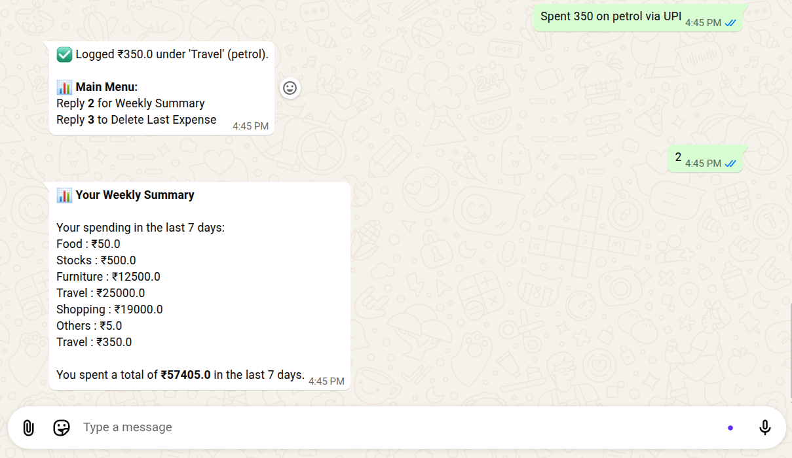
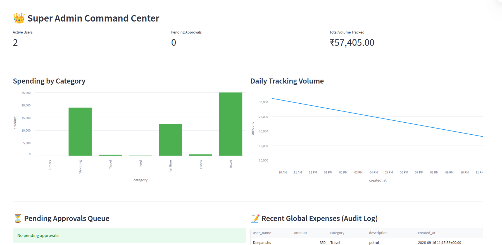

# 🤖 Autonomous Finance Tracker AI Agent

[](https://autonomous-finance-tracker-ai-agent.streamlit.app/)

An intelligent, WhatsApp-native personal finance tracking agent. It uses an LLM to parse conversational expenses, logs them into a PostgreSQL database, and features an autonomous background agent for automated reporting.

**🔗 [Access the Live Admin Dashboard Here](https://autonomous-finance-tracker-ai-agent.streamlit.app/)**

![WhatsApp Chat Demo]
*Caption: The AI Agent extracting expenses from natural language and displaying the interactive text menu.*

---

## ⚡ Key Features

* **LLM-Powered Extraction:** Log expenses using everyday language (e.g., *"Spent 350 on petrol via UPI"*). The LLM strictly maps inputs to predefined database categories.
* **Role-Based Access Control (RBAC):** Multi-tier security (`super_admin`, `admin`, `user`) with state-driven onboarding and in-chat approval workflows.
* **Autonomous Background Scheduler:** A cron-based agent wakes up automatically to calculate and broadcast weekly financial summaries to approved users.
* **Frictionless UI:** Numbered, text-based interactive menus within WhatsApp for quick actions (e.g., fetching summaries, deleting recent logs).
* **Command Center Dashboard:** A Streamlit-based web UI for real-time KPIs, expense visualization, and approval queue management.

![Admin Dashboard]
*Caption: The Super Admin Streamlit dashboard displaying live database metrics and charts.*

---

## 🏗️ System Architecture

This system utilizes a microservices-inspired architecture to separate the messaging gateway from the AI logic.

```text
[WhatsApp User] 
       │
       ▼
[Node.js Bridge] ──────► Outbound Gateway (whatsapp-web.js + LocalAuth)
       │                 Handles real-time push notifications & LID routing
       ▼
[FastAPI Backend] ─────► The Core Agentic System
       ├── [Access Guard]   (Validates user state and permissions)
       ├── [LLM Parser]     (Groq API extracts structured JSON)
       ├── [Task Scheduler] (APScheduler handles automated cron jobs)
       └── [Database]       (Supabase/PostgreSQL manages relationships & cascades)
       
[Streamlit UI] ────────► Super Admin Visual Dashboard
```

---

## 🚀 How to Run Locally

### 1. Start the WhatsApp Bridge (Port 3000)
```bash
cd whatsapp-bridge
npm install
node bridge.js
```

### 2. Start the AI Backend (Port 8000)
```bash
python3 -m venv venv
source venv/bin/activate
pip install -r requirements.txt
uvicorn app.main:app --reload
```

### 3. Launch the Admin Dashboard
```bash
streamlit run dashboard.py
```